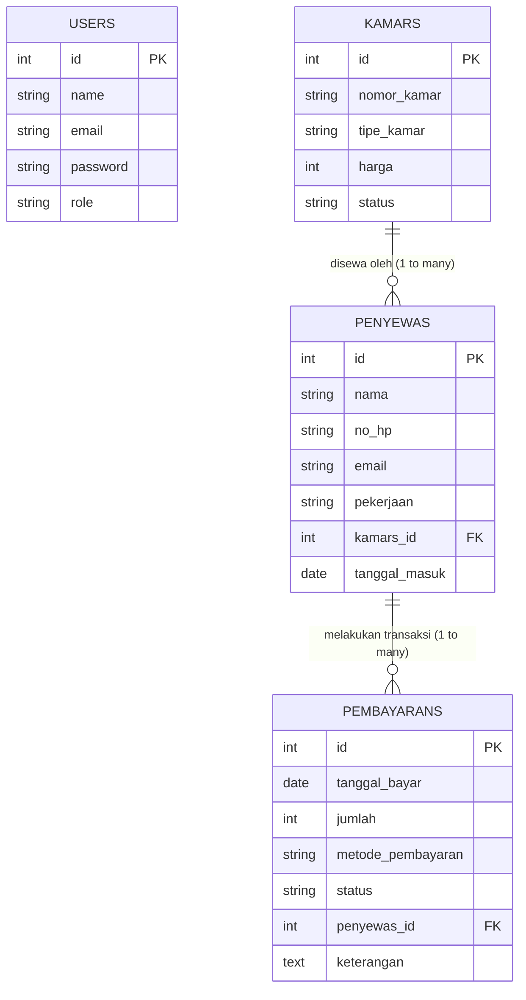

# Catatan Belajar: Analisis ERD dan Kebutuhan Sistem Hotel

Catatan ini dirancang untuk membantu Anda mempelajari hubungan database (**ERD**) dan bagaimana menerapkannya ke dalam kode **Laravel** pada proyek pengelolaan **Hotel 404 Not Found** ini.

---

## 1. Skema ERD (Entity Relationship Diagram)

Sistem ini memiliki 4 entitas utama: **User**, **Kamar**, **Tamu (Penyewa)**, dan **Pembayaran**.

Berikut adalah visualisasi hubungan database dalam bentuk diagram ERD:



### Hubungan Antar Tabel (Relasi)
1. **Kamar ↔ Tamu (One-to-Many)**
   - **Aturan**: Satu Kamar Hotel dapat disewa oleh banyak Tamu secara bergantian (riwayat check-in), namun satu Tamu aktif hanya menempati satu kamar pada satu waktu.
   - **Foreign Key**: Kolom `kamars_id` pada tabel `penyewas` (tabel database untuk data Tamu) merujuk ke `id` pada tabel `kamars`.

2. **Tamu ↔ Pembayaran (One-to-Many)**
   - **Aturan**: Satu Tamu dapat melakukan beberapa kali Transaksi Pembayaran (misal: uang muka/DP, pelunasan, atau sewa tambahan). Satu transaksi Pembayaran hanya milik satu Tamu.
   - **Foreign Key**: Kolom `penyewas_id` pada tabel `pembayarans` merujuk ke `id` pada tabel `penyewas`.

---

## 2. Struktur Tabel & Atribut

### A. Tabel `users` (Akses Pengguna/Karyawan)
Digunakan untuk login ke sistem dengan hak akses berbeda:
- `id` (Primary Key)
- `name` (Nama user/karyawan)
- `email` (Username login)
- `password` (Kata sandi terenkripsi)
- `role` (`admin`, `owner`, `staff`) - menentukan hak akses halaman dashboard.

### B. Tabel `kamars` (Data Kamar Hotel)
- `id` (Primary Key)
- `nomor_kamar` (Unik, misal: *101*, *202*)
- `tipe_kamar` (Misal: *Deluxe*, *Suite*, *Standard*)
- `harga` (Tarif per malam dalam rupiah)
- `status` (`Tersedia`, `Terisi`, `Pemeliharaan`)

### C. Tabel `penyewas` (Tabel Database untuk Data Tamu)
*Catatan: Meskipun di tampilan web dinamakan "Data Tamu", di database tabelnya dinamai `penyewas` sesuai konvensi awal.*
- `id` (Primary Key)
- `nama` (Nama Lengkap Tamu)
- `no_hp` (Nomor telepon aktif)
- `email` (Alamat email)
- `pekerjaan` (Pekerjaan tamu)
- `kamars_id` (Foreign Key ke `kamars`)
- `tanggal_masuk` (Tanggal check-in)

### D. Tabel `pembayarans` (Transaksi Pembayaran)
- `id` (Primary Key)
- `tanggal_bayar` (Waktu pembayaran dilakukan)
- `jumlah` (Nominal uang yang dibayar)
- `metode_pembayaran` (`Transfer`, `Tunai`)
- `status` (`Lunas`, `Pending`, `Gagal`)
- `penyewas_id` (Foreign Key ke `penyewas`)
- `keterangan` (Catatan opsional)

---

## 3. Implementasi Relasi di Model Laravel

### Model Kamar ([app/Models/Kamar.php](file:///c:/laragon/www/Analisis-ERD-dan-kebutuhan-sistem/app/Models/Kamar.php))
Kamar memiliki hubungan `hasMany` (banyak) ke Tamu (`Penyewa`):
```php
public function penyewas()
{
    return $this->hasMany(Penyewa::class, 'kamars_id');
}
```

### Model Tamu / Penyewa ([app/Models/Penyewa.php](file:///c:/laragon/www/Analisis-ERD-dan-kebutuhan-sistem/app/Models/Penyewa.php))
Tamu terikat ke satu Kamar (`belongsTo`) dan memiliki banyak Pembayaran (`hasMany`):
```php
public function kamar()
{
    return $this->belongsTo(Kamar::class, 'kamars_id');
}

public function pembayarans()
{
    return $this->hasMany(Pembayaran::class, 'penyewas_id');
}
```

### Model Pembayaran ([app/Models/Pembayaran.php](file:///c:/laragon/www/Analisis-ERD-dan-kebutuhan-sistem/app/Models/Pembayaran.php))
Pembayaran milik satu Tamu (`belongsTo`):
```php
public function penyewa()
{
    return $this->belongsTo(Penyewa::class, 'penyewas_id');
}
```

---

## 4. Alur Belajar Praktis Anda Selanjutnya
1. **Melihat Migrasi Database**: File migrasi untuk struktur tabel di atas dapat Anda lihat di folder [database/migrations/](file:///c:/laragon/www/Analisis-ERD-dan-kebutuhan-sistem/database/migrations).
2. **Melihat Seeders (Data Awal)**: Untuk mengetahui bagaimana data simulasi dibuat, cek file [DatabaseSeeder.php](file:///c:/laragon/www/Analisis-ERD-dan-kebutuhan-sistem/database/seeders/DatabaseSeeder.php).
3. **Membuka Dashboard**: Buka link browser [http://analisis-erd-dan-kebutuhan-sistem.test](http://analisis-erd-dan-kebutuhan-sistem.test) dan login menggunakan:
   - **Email / Username**: `admin@admin.com` atau `admin`
   - **Password**: `admin`
